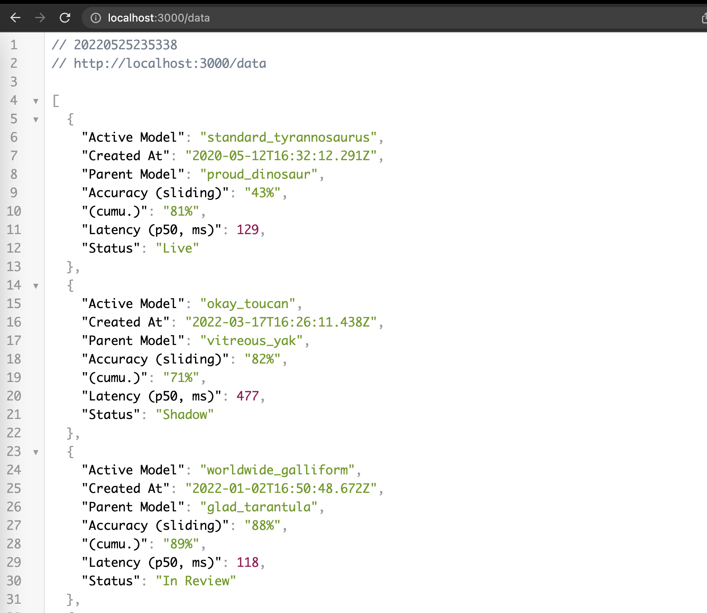

# table-json-server

A JSON server for table data.

## Prerequisites
- Install Nodejs and npm (https://nodejs.org/en/download/)

## Instructions
1. Clone this repo
2. `npm install`
3. `npm install -g json-server` (See https://www.npmjs.com/package/json-server)
4. `json-server --watch server/table-data.json`

## Regenerate data
1. `node utils/json-generator.js`
